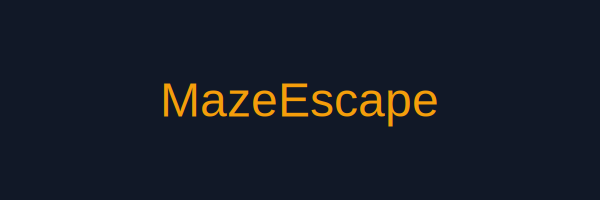
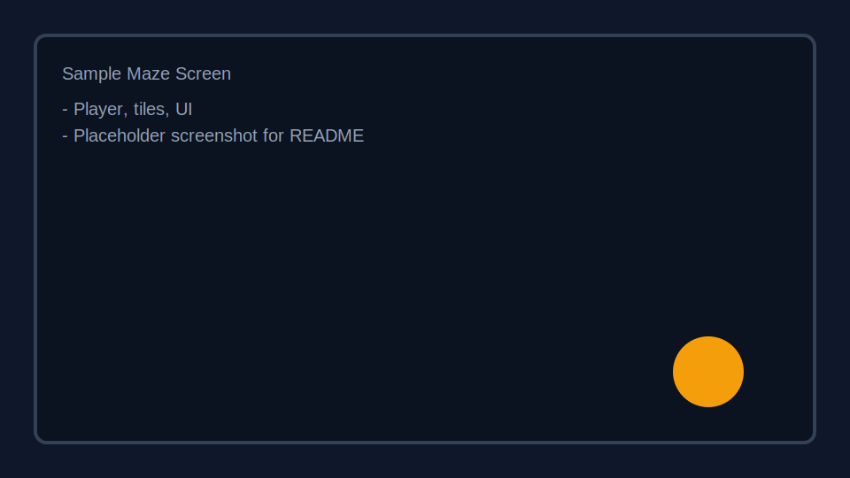

# MazeEscape


MazeEscape is a cross-platform puzzle game built with .NET MAUI. Navigate mazes, collect chests, and unlock new skins and levels across multiple worlds.

**Key Features**

- Polished maze gameplay with collectible chests and skins.

- Campaign and daily maze modes.

- Cross-platform support via .NET MAUI (Windows, macOS, iOS, Android, Mac Catalyst).

**Screenshots**



## 🚀 Quick Start

### Prerequisites
- **[.NET SDK 9.0](https://dotnet.microsoft.com/download/dotnet/9.0)** or later
- **Git**

### One-Minute Setup
```bash
# Clone repo
git clone https://github.com/JJFrisch/MazeEscape.git
cd MazeEscape

# Run setup script
# macOS/Linux:
bash setup.sh
# Windows:
setup.bat

# Start the API
dotnet run --project MazeEscape.Api

# Test in another terminal
curl http://localhost:5000/api/health
```

You should see:
```json
{
  "status": "healthy",
  "service": "MazeEscape.Api",
  "environment": "Development",
  "timestamp": "..."
}
```

## 📖 Documentation

New to the project? Start here:

| Document | Purpose |
|----------|---------|
| **[LOCAL_DEVELOPMENT.md](LOCAL_DEVELOPMENT.md)** | Complete setup guide for your machine |
| **[API_SETUP_SUMMARY.md](API_SETUP_SUMMARY.md)** | Overview of what was added |
| **[DEPLOYMENT_CHECKLIST.md](DEPLOYMENT_CHECKLIST.md)** | Production deployment steps |
| **[docs/index.html](docs/index.html)** | Interactive API documentation |

## Getting Started (Original)

Prerequisites:

- Install the .NET SDK 9 or later. See https://dotnet.microsoft.com/

- Install .NET MAUI workloads for your platform (follow Microsoft's MAUI setup docs).

Clone the repo and run:

```bash
git clone https://github.com/JJFrisch/MazeEscape.git
cd MazeEscape
dotnet restore
dotnet build
```

To run on macOS (Mac Catalyst):

```bash
dotnet build -f:net8.0-maccatalyst
open bin/Debug/net8.0-maccatalyst/maccatalyst-arm64/MazeEscape.app
```

To run on Windows (if available):

```bash
dotnet build -f:net8.0-windows10.0.19041.0
```

For Android and iOS, use your IDE (Visual Studio for Mac/Windows) or `dotnet` tooling with appropriate emulators/simulators.

**Project Structure (high level)**

- `App.xaml` / `App.xaml.cs` – App entry and resources.
- `Pages/` – XAML pages for UI (Campaign, Worlds, Shop, Settings).
- `Models/` – Game models: `Maze`, `MazeCell`, `CampaignLevel`, etc.
- `Controls/` – Custom controls and data template selectors.
- `Drawables/` – GraphicsView drawables for rendering the maze and player.
- `Resources/Images/` – Game art assets.
- `Images/` – Documentation images used by this README.

**Assets & Images**

Documentation images are in the `Images` folder. Game assets live under `Resources/Images` and `Resources/Raw` for raw data files.

**Contributing**

- Fork the repository, create a feature branch, and submit a pull request.
- Keep platform-specific changes isolated and provide testing notes for each platform.

**Troubleshooting**

- If you encounter MAUI workload issues, run `dotnet workload install maui`.
- Clear NuGet caches if builds fail with `dotnet nuget locals all --clear`.

**Web Deployment (GitHub Pages)**

- GitHub Pages deployment workflow: `.github/workflows/deploy-pages.yml`
- Deployment checklist: `docs/deployment-checklist.md`
- Default Pages URL for this repo: `https://jjfrisch.github.io/MazeEscape/`

**License**


---


